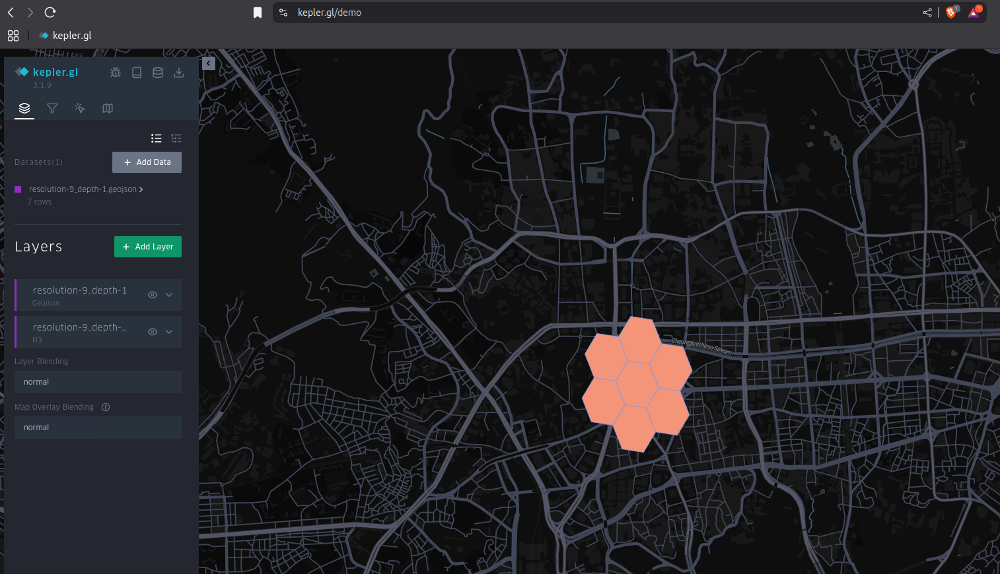
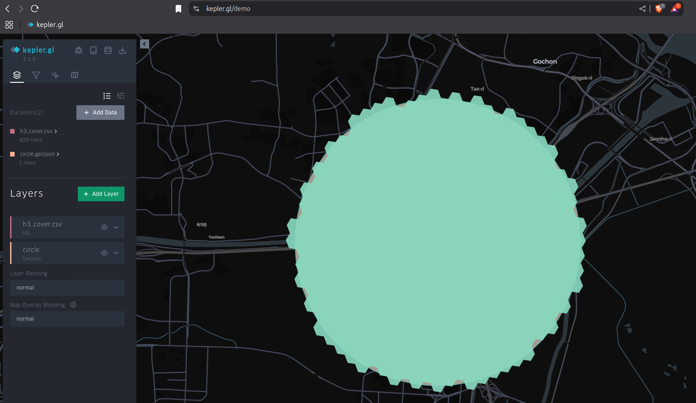
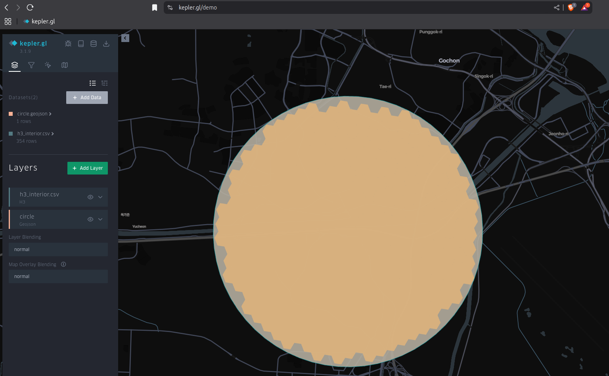

# H3 Ring & Polyfill Service

A tiny FastAPI service (Dockerized) for generating **H3 indexes** around a point or covering a GeoJSON polygon.
Outputs **GeoJSON** (text) or **CSV** that you can upload directly into kepler.gl (as an H3 layer).

---

## Quick Start

### Build

```bash
docker build -t h3ro .
```

### Run

```bash
docker run -p 8000:8000 h3ro
```

Server starts at: `http://localhost:8000`

Open docs: `http://localhost:8000/docs`

---

## Endpoints

### 1) `GET /h3-ring` → GeoJSON (text)

Generate a center H3 cell and its k‑ring neighbors around a lat/lng.

**Query params**

* `lat` (required, float)
* `lng` (required, float)
* `resolution` (optional, int 0–15, default `9`)
* `ring_k` (optional, int ≥ 0, default `1`)

**Example**

```bash
curl "http://localhost:8000/h3-ring?lat=37.5665&lng=126.9780&resolution=9&ring_k=1"
```

**Response**: raw GeoJSON FeatureCollection (polygons of the hexes).

<a href="assets/resolution-9_depth-1.png" target="_blank">
    
</a>

---

### 2) `POST /h3-ring` → GeoJSON (text)

Same as above, but pass a JSON body.

**Body**

```json
{
  "lat": 37.5665,
  "lng": 126.9780,
  "resolution": 9,
  "ring_k": 1
}
```

**Example**

```bash
curl -X POST http://localhost:8000/h3-ring \
  -H "Content-Type: application/json" \
  -d '{"lat":37.5665,"lng":126.9780,"resolution":9,"ring_k":1}'
```

---

### 3) `GET /h3-ring-csv` → CSV (text/csv)

Return a CSV of H3 indexes for the k‑ring around a point (one column: `h3_index`).

**Query params**

* `lat` (required)
* `lng` (required)
* `resolution` (default `9`)
* `ring_k` (default `1`)

**Example**

```bash
curl "http://localhost:8000/h3-ring-csv?lat=37.5665&lng=126.9780&resolution=9&ring_k=1"
```

Save to file:

```bash
curl "http://localhost:8000/h3-ring-csv?lat=37.5665&lng=126.9780&resolution=9&ring_k=1" \
  -o h3_ring.csv
```

---

### 4) `POST /h3-ring-csv` → CSV (text/csv)

Same as above, but pass a JSON body.

**Body**

```json
{
  "lat": 37.5665,
  "lng": 126.9780,
  "resolution": 9,
  "ring_k": 1
}
```

**Example**

```bash
curl -X POST http://localhost:8000/h3-ring-csv \
  -H "Content-Type: application/json" \
  -d '{"lat":37.5665,"lng":126.9780,"resolution":9,"ring_k":1}'
```

---

### 5) `POST /h3-polyfill-csv` → CSV (text/csv)

Cover a **GeoJSON Polygon** with H3 cells.

* **`interior=false`** (default): returns a covering that **fully covers** the polygon.
  You can optionally **pad** the polygon outward with `buffer` (degrees) to catch edge cells.
* **`interior=true`**: returns only H3 cells **fully contained** inside the polygon (no buffer used).

**Query params**

* `resolution` (required, 0–15)
* `interior` (optional, default `false`)
* `buffer` (optional, degrees, default `0.0`; used only when `interior=false`)

**Body** (GeoJSON FeatureCollection with a Polygon; first feature is used)

```json
{
  "type": "FeatureCollection",
  "features": [{
    "type": "Feature",
    "properties": {},
    "geometry": {
      "type": "Polygon",
      "coordinates": [
        [
          [126.77069181498143, 37.57236186210446],
          [126.77044935357029, 37.57500721021979],
          [126.7698822498543, 37.57762090068464],
          ...
          [126.77069181498143, 37.57236186210446]
        ]
      ]
    }
  }]
}
```

> Make sure your polygon’s first and last coordinate are identical (closed ring).

**Examples**

* **Covering (interior=false) with a small outward buffer**

```bash
curl -X POST "http://localhost:8000/h3-polyfill-csv?resolution=9&interior=false&buffer=0.0005" \
  -H "Content-Type: application/json" \
  --data-binary @circle.geojson \
  -o h3_cover.csv
```

<a href="assets/h3_cover.png" target="_blank">
    
</a>

* **Strict interior only (no buffer applied)**

```bash
curl -X POST "http://localhost:8000/h3-polyfill-csv?resolution=9&interior=true" \
  -H "Content-Type: application/json" \
  --data-binary @circle.geojson \
  -o h3_interior.csv
```

<a href="assets/h3_interior.png" target="_blank">
    
</a>

**Response**: CSV with a single header and one H3 index per row:

```csv
h3_index
89283082837ffff
89283082833ffff
...
```

---

## Using Outputs in kepler.gl

* For CSV outputs (`*ring-csv`, `*polyfill-csv`):

    * Upload the CSV
    * Add a **Layer** → choose **H3** type
    * Select the `h3_index` column

* For GeoJSON output (`/h3-ring`):

    * Upload the returned text as a `.geojson` file
    * Add a **Polygon** layer

---

## Notes

* **H3 resolution** range: `0` (coarse) … `15` (fine)
* `buffer` is in **degrees**; near Seoul:

    * `0.0001` ≈ \~11 m
    * `0.0005` ≈ \~55 m
    * `0.0010` ≈ \~110 m
* `buffer` is **ignored** when `interior=true`.
* Only the **first feature** in the FeatureCollection is used; geometry must be a **Polygon** (no holes yet).

---

## Troubleshooting

* **500 + “module not found”**: make sure Docker image was rebuilt after editing `requirements.txt`.
* **Polygon not fully covered with `interior=false`**: try a small `buffer` like `0.0005`.
* **FastAPI docs** not loading: confirm container is running and port mapping (`-p 8000:8000`) is correct.

---

## Tech

* Python + FastAPI
* `h3` (Uber’s H3 Python bindings)
* `shapely` for buffering & strict containment checks
* Runs in Docker (`python:3.11-slim` base)

---

That’s it! If you want MultiPolygon support, holes, or `application/geo+json` responses, say the word and I’ll extend the API.
